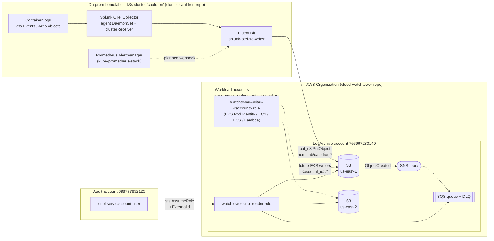
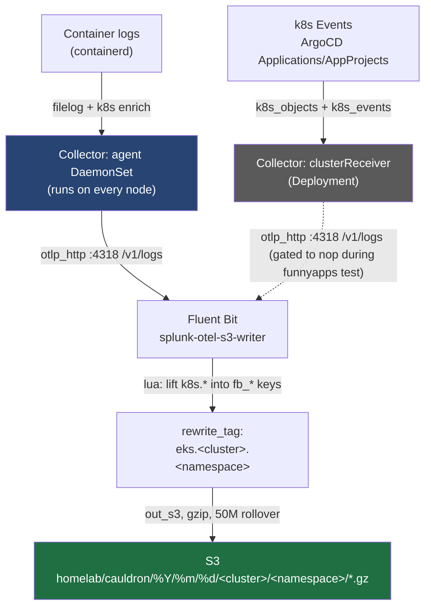
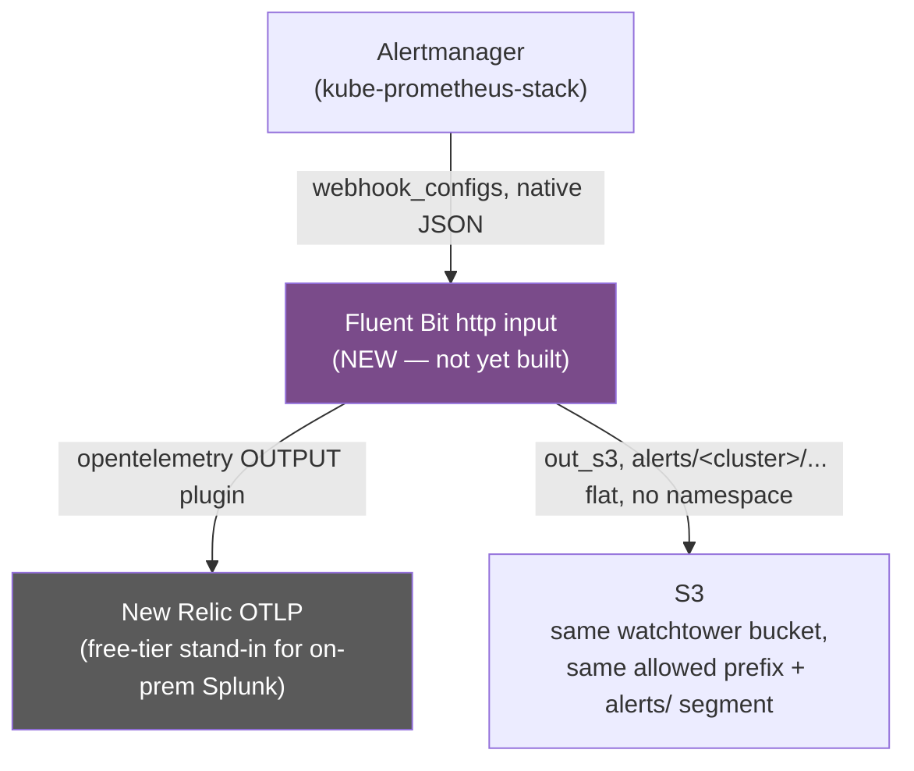
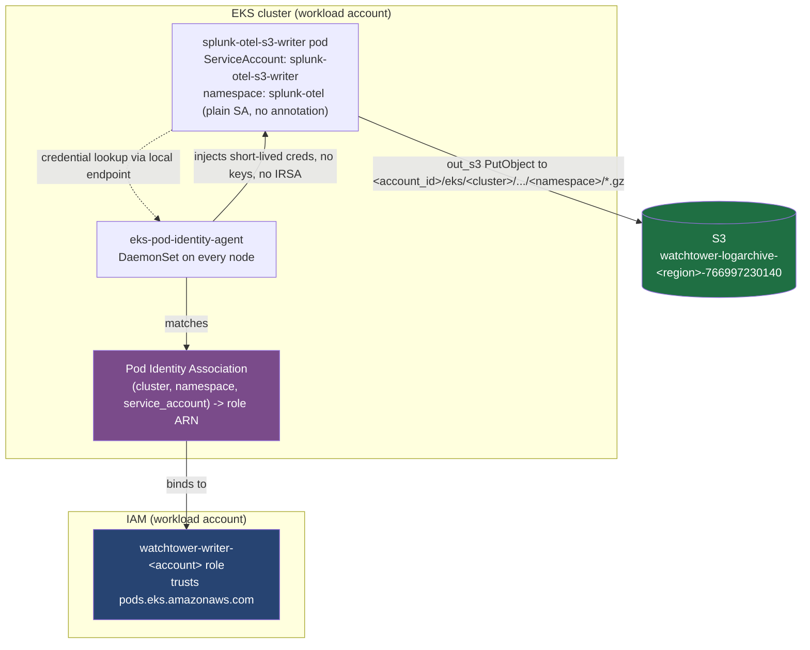
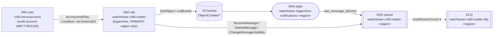
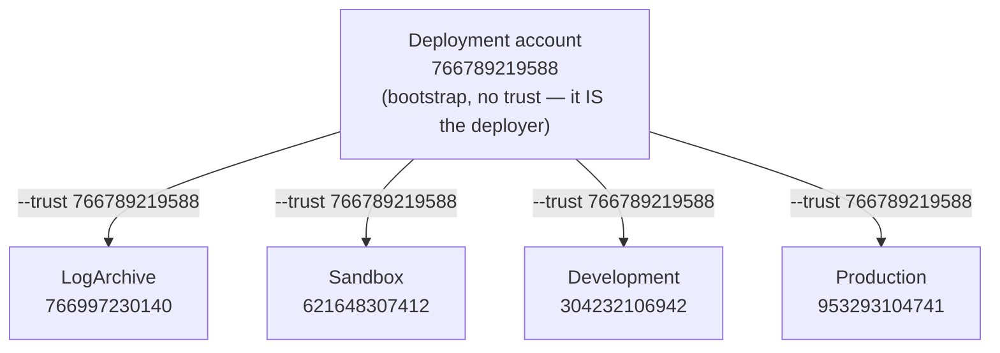
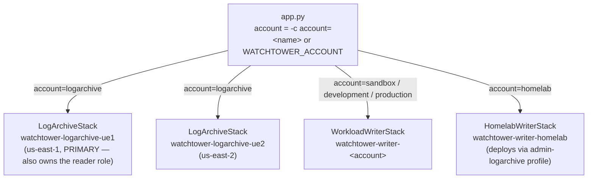

# cloud-watchtower

A home-lab-grade, org-wide **log archive** for everything that runs on
`imac-depot`'s k3s cluster (`cauldron`) and, eventually, ephemeral EKS
clusters in the same AWS Organization. Application/container logs, Kubernetes
events, and (planned) Prometheus Alertmanager alerts all converge on one
Splunk OTel Collector → Fluent Bit pipeline, which ships them to a
central S3 bucket in a dedicated **LogArchive** AWS account. From there,
**Cribl** pulls them back out (via SNS → SQS) for downstream processing —
mirroring an already-proven CloudTrail → Cribl pattern.

This repo (`cloud-watchtower`) owns **everything AWS-side**: the S3 buckets,
their lifecycle, the SNS/SQS fan-out, and every IAM role/user involved on
both the write side (workloads writing logs in) and the read side (Cribl
reading them out). It does **not** own anything inside a Kubernetes cluster —
that's the companion repo, [`cluster-cauldron`](../cluster-cauldron)
(ArgoCD, Splunk OTel Collector, Fluent Bit config, ArgoCD app-of-apps
bootstrap). See [§6](#6-cross-repo-boundary) for the exact line.

> **Read this first if you're picking this project back up after a long
> break.** [§7](#7-quick-start--runbook-for-future-you) is the "how do I even
> start" cheat sheet. Everything else is context for *why* things are shaped
> the way they are.

## Status at a glance

| Component | Status | Notes |
| --- | --- | --- |
| LogArchive S3 buckets (us-east-1 + us-east-2) | ✅ Deployed | `LogArchiveStack`, SSE-S3, 30-day expiry |
| SNS → SQS fan-out (Cribl reader queue) | ✅ Deployed | per region, `raw_message_delivery: true` |
| `watchtower-cribl-reader` IAM role | ✅ **Verified live** (2026-09-06) | ExternalId-gated, ported from CloudTrail pattern |
| `watchtower-writer-<account>` roles (sandbox/dev/prod) | ✅ Deployed; `development` **verified live** | sandbox/production deployed per `cdk.out`, re-verify with `make diff` before trusting blindly |
| `watchtower-writer-home` IAM user (homelab) | ✅ Deployed | access key minted out-of-band, not in CDK |
| On-prem container-log pipeline (collector → Fluent Bit → S3) | ✅ **Live** (Stage 2 of the funnyapps test) | writing to `homelab/cauldron/` prefix today |
| k8s Events / ArgoCD object archival | ⏸️ Paused | cluster-receiver gated to `nop` during the funnyapps test — see [§3.1](#31-whats-live-today) |
| EKS writer path (Pod Identity) | 🧩 IAM side built, cluster side not yet exercised | no EKS cluster has created the Pod Identity association yet |
| Alertmanager → Fluent Bit → New Relic/S3 | 📝 **Design only, not built** | POC spec lives in `cluster-cauldron`'s `splunk-otel/CLAUDE.md` — see [§3.3](#33-planned-alertmanager--fluent-bit--new-relic--s3) |
| SSE-KMS, CDK pipeline, Loki reader | 📝 Deferred (by design) | home-lab cost decision — see [§8](#8-open-items--roadmap) |

---

## 1. Vision

One S3 bucket family is the **single durable home** for every log-shaped
thing this org produces — container logs today, Kubernetes events and
Alertmanager alerts tomorrow — regardless of whether the workload runs
on-prem (k3s, no AWS account) or on EKS (a real workload account). Writers
only ever get a **write-only, own-prefix** identity; nothing that writes logs
can read or delete them. A single, narrowly-scoped **reader role** is the
only thing that can pull data back out, and only Cribl (via an
ExternalId-gated cross-account AssumeRole) holds that key today.

The design deliberately ports a pattern that's *already running and proven*
in production for CloudTrail → Cribl (S3 → SNS → SQS fan-out, ExternalId-gated
reader role) rather than inventing a new one — see
[`docs/plan.md` §0](docs/plan.md#0-ground-truth-discovered-from-the-live-org)
for the reverse-engineered reference implementation this app mirrors.



---

## 2. Repo layout

```
cloud-watchtower/
  README.md                 you are here
  docs/
    plan.md                 the concrete, named build plan (section-numbered, ground truth)
    iam-s3-design.md         the original design doc (bucket/IAM shape, some parts now superseded)
    iam-trust-verified.md    live-AWS verification of the two IAM trust models (2026-09-06)
    cribl-s3.md              vendored Cribl docs: how the S3 Source / SQS notifications work
  cdk/
    app.py                   entrypoint; account -> stacks
    cdk.json                 cdk app cmd + context (account IDs, org id, bootstrap qualifier)
    Makefile                 the ONLY deploy path; guardrails baked in
    CLAUDE.md, .kiro/steering/  agent-facing conventions (read these before changing CDK code)
    configs/
      infrastructure.yaml    globals + per-account overrides (deep-merged, account wins)
      config.py              loader: ${ENV} + cdk.json context substitution -> typed spec
      models.py              dataclasses hydrated by dacite
    stacks/
      log_archive_stack.py       logarchive side (per region: bucket, SNS, SQS, reader role)
      workload_writer_stack.py   EKS workload side (per account, cross-account writer role)
      homelab_writer_stack.py    home-lab side (IAM user in the logarchive account)
    utils/
      converters.py           deep-merge helper
      logger.py               structured logging
```

---

## 3. On-prem homelab pipeline: Splunk OTel + Fluent Bit + Prometheus/Alertmanager

This section covers what lives in **`cluster-cauldron`** (a different repo),
kept here because it's the other half of the story: this is the thing that
actually produces the objects landing in the buckets this repo builds.

### 3.1 What's live today



- **Splunk OTel Collector** (`splunk-otel-collector` Helm chart, pinned
  `0.159.0`) runs two components: an **agent DaemonSet** that tails container
  logs on every node (containerd runtime), and a **clusterReceiver**
  Deployment that watches Kubernetes objects — including ArgoCD
  `Application`/`AppProject` CRs — and cluster Events.
- Both pipelines export via the collector's `otlp_http` exporter to an
  **in-cluster Fluent Bit** Service (`splunk-otel-s3-writer.splunk-otel:4318`,
  the `opentelemetry` input). There is **no real Splunk endpoint** in this
  home-lab flavor — `splunkPlatform` in `values.yaml` is deliberately inert,
  just there to satisfy the chart's schema.
- Fluent Bit's job: **lift + sanitize** the OTLP record's Kubernetes resource
  attributes (`otlp_k8s_tag.lua`) into `fb_cluster`/`fb_namespace`/etc.,
  **compose a routing tag** (`rewrite_tag`: `eks.<cluster>.<namespace>` — the
  `eks.` prefix is just a routing tag, it applies on-prem too), and
  **write gzipped NDJSON objects to S3** (`out_s3`) under the fixed literal
  prefix `homelab/cauldron/` — the only prefix the on-prem IAM user is allowed
  to write into (see [§4.3](#43-write-path-iam-writer-roles)).
- **Currently scoped to two test namespaces** (`funnyapp1`/`funnyapp2`) via an
  agent-side include-annotation filter, and the clusterReceiver's log
  pipelines are gated to a `nop` exporter — so **k8s Events and ArgoCD
  objects are not currently reaching S3**, only funnyapp container logs. This
  is a deliberate, reversible test scope (see `cluster-cauldron`'s
  `docs/funnyapps-s3-log-archival-testplan.md`), not a permanent restriction —
  flipping the `nop` exporters back to `otlp_http/fluentbit_s3` restores full
  collection.
- **Known open validation item:** the exact JSON path where Fluent Bit's
  `opentelemetry` input places OTLP *resource* attributes (needed for the
  `fb_cluster`/`fb_namespace` lift) was not nailed down in the docs for the
  pinned `fluent-bit:5.1.1` image at design time. `otlp_k8s_tag.lua` probes
  multiple candidate shapes defensively so a wrong guess degrades to
  `unknown_cluster`/`unknown_ns` rather than crashing — but if you see
  `unknown_*` segments in S3 keys, this is the first thing to check
  (`cluster-cauldron/docs/watchtower-pod-identity.md` §7 has the exact
  validation procedure).

### 3.2 How the homelab cluster bootstraps this (cross-repo)

The k3s control node (`cauldron`, physical host `imac-depot`) is
Tailscale-reachable and runs **ArgoCD** as its GitOps brain
(`cluster-cauldron/bootstrap/bootstrap.sh`: `k3s` → `argocd` → `tailscale`
phases). Everything after that is declarative:

1. An **app-of-apps root** Application watches
   `apps/app-of-apps/children/**/app.yaml` in `cluster-cauldron` and
   registers each child as its own ArgoCD `Application`.
2. `splunk-otel` is one such child — a **Kustomize-renders-Helm** source
   (`kustomize build --enable-helm`, not a native Helm source) that inflates
   the `splunk-otel-collector` chart plus a handful of plain Fluent Bit
   manifests (`Namespace`, `ServiceAccount`, `Service`, `Deployment`) defined
   alongside it.
3. Sync is **manual only** (`argocd app sync splunk-otel`) — no auto-sync,
   no self-heal, by repo-wide convention. Config changes (like flipping
   `out_null` → `out_s3`, or the AM webhook work below) go through a GitOps
   PR flow in `cluster-cauldron`, get merged, then are synced by hand.
4. `kube-prometheus-stack` (Prometheus + Alertmanager + Grafana) is a sibling
   app-of-apps child, deployed the same way, in the same cluster — it is
   **not currently wired to** splunk-otel/Fluent Bit at all; see §3.3 for the
   planned connection.

This repo (`cloud-watchtower`) has **zero visibility or control** over any of
the above — it only guarantees that if something in that cluster authenticates
as `watchtower-writer-home` (or, on EKS, assumes `watchtower-writer-<account>`)
and writes into its allowed prefix over TLS, the object lands durably in S3
and a notification reaches the Cribl queue.

### 3.3 Planned: Alertmanager → Fluent Bit → New Relic + S3

**Not built yet — this is a recorded design, not running infrastructure.**
Full spec lives in `cluster-cauldron/apps/app-of-apps/children/splunk-otel/CLAUDE.md`;
summarized here because it's part of the eventual "everything log-shaped
lands in the watchtower bucket" vision.

The problem: Alertmanager's webhook receiver POSTs its own JSON shape
(`version`, `groupKey`, `status`, `alerts[]`, ...) — it is **not** an OTLP
payload, so pointing it directly at the collector's OTLP HTTP receiver
doesn't work. The fix (already proven at $DAYJOB, being POC'd here) is to put
**Fluent Bit in front as the webhook endpoint** itself:



Key decisions already made (so a future implementer doesn't re-litigate
them):

- **New Relic is a POC stand-in**, not a permanent destination — this home
  lab has no on-prem Splunk to point real OTLP at. Swapping the OTLP output's
  endpoint/headers to a real Splunk endpoint later should be config-only.
- **No new IAM identity, no new bucket, no new prefix scheme** — alerts ride
  the *same* watchtower bucket and the *same* per-flavor IAM identity
  (`watchtower-writer-home` on-prem, `watchtower-writer-<account>` on EKS)
  that container logs already use. Only a new `alerts/<cluster>/` prefix
  segment (flat — alerts don't reliably map to one k8s namespace) is added
  *inside* the already-allowed prefix.
- **Alert tag is `alert.<cluster>`**, cluster name from a fixed env var (same
  mechanism as `$AWS_ACCOUNT_ID` on the EKS writer path) — no per-alert
  namespace lookup.
- Open/undecided at design time: the new Fluent Bit `http` input's port +
  Service exposure, and the New Relic OTLP credentials (a new Secret, not yet
  created).

---

## 4. AWS build-out

### 4.1 Accounts & regions

| Account | ID | SSO profile | Role |
| --- | --- | --- | --- |
| Management | `634946559451` | `admin-management` | org root, not a deploy target |
| Deployment | `766789219588` | `admin-deployment` | CDK deployer, trusted into every target |
| **LogArchive** | `766997230140` | `admin-logarchive` | owns buckets, SNS, SQS, reader role, **and** the homelab writer user |
| Audit | `698777852125` | `admin-audit` | home of `cribl-servicaccount`, the IAM user Cribl authenticates as |
| Sandbox | `621648307412` | `admin-sandbox` | workload account — writer role |
| Development | `304232106942` | `admin-development` | workload account — writer role |
| Production | `953293104741` | `admin-production` | workload account — writer role |

Org ID: `o-x82cglkqhs`. Regions: **us-east-1** (primary) and **us-east-2**,
short codes `ue1`/`ue2`. Every logarchive resource is instantiated
independently in both regions — there is **no cross-region replication**; the
two regional buckets are fully separate copies of the same shape, and a
workload account's single writer role can write into either.

### 4.2 S3 log archive buckets

One bucket per region, named `watchtower-logarchive-<region>-766997230140`:

- **Block all public access**, `enforce_ssl=True` (adds a bucket-wide deny on
  `aws:SecureTransport=false` — **TLS is mandatory**, a plaintext S3 endpoint
  in any client will get `AccessDenied` on every request).
- **SSE-S3 (AES256)** — free tier, deliberately not SSE-KMS yet (see
  [§8](#8-open-items--roadmap)).
- **Versioning off.** Lifecycle rule expires **all objects at 30 days**
  (age-based on `LastModified`, no storage-class transitions), and aborts
  incomplete multipart uploads after **7 days** (closes a silent
  orphaned-parts cost leak from failed Fluent Bit multipart PUTs).
- `RemovalPolicy.RETAIN` — the bucket container survives a stack delete; the
  30-day lifecycle is what actually controls storage cost.
- **Bucket policy** (the entire cross-account write contract, in two
  statements):
  - `Allow s3:PutObject` for **any principal in the org**
    (`aws:PrincipalOrgID = o-x82cglkqhs`), but only into
    `<bucket>/${aws:PrincipalAccount}/*` — the calling principal's own AWS
    account ID, resolved server-side. This is why **onboarding a new
    workload account never touches this bucket policy** — the resource-side
    boundary already covers any org member.
  - `Deny s3:DeleteObject*` for everyone — the backstop for "writers can
    never delete," enforced independent of any identity policy — **except**
    one carved-out principal-ARN pattern
    (`admin_delete_principal_arn_pattern`, an `aws:PrincipalArn` /
    `StringNotLike` condition on the deny). Currently set to the
    `AdministratorAccess` SSO role in the logarchive account, so that role
    alone can delete for manual cleanup; every writer identity stays
    delete-denied. See [iam-s3-design.md §5](docs/iam-s3-design.md).

### 4.3 Write path: IAM writer roles

Two writer shapes exist, because the on-prem cluster has no AWS account
behind it and the EKS clusters do:

| | **EKS workload accounts** (`WorkloadWriterStack`) | **Home-lab** (`HomelabWriterStack`) |
| --- | --- | --- |
| Identity | IAM **role** `watchtower-writer-<account>` | IAM **user** `watchtower-writer-home`, in the **logarchive** account |
| How compute authenticates | EKS Pod Identity / EC2 instance profile / ECS task role / Lambda execution role — trust policy covers all four service principals | static access key in a k8s `Secret`, consumed via `envFrom` — minted **out of band**, never by CDK |
| Cross-account? | Yes — role lives in the workload account, writes into the shared bucket in logarchive | No — same-account grant (user and bucket both live in `766997230140`) |
| Allowed prefix | `<account_id>/*`, keyed dynamically off the caller's own account | `homelab/cauldron/*`, a **fixed literal** (no `aws:PrincipalAccount` equivalent exists for a same-account user) |
| Actions | `s3:PutObject`, `s3:AbortMultipartUpload`, `s3:GetBucketLocation` — **no delete**, in both cases |

`EksPodIdentity`'s trust statement is the only one that also grants
`sts:TagSession` (Pod Identity requires it).

#### 4.3.1 EKS write-path walkthrough

The role and its policy (`WorkloadWriterStack`) are only half the story — a
role existing doesn't mean any pod can use it. The other half, **Pod
Identity**, is a separate binding step owned on the `cluster-cauldron` side:



The **collector → Fluent Bit → `rewrite_tag` → `out_s3`** pipeline upstream of
the pod is byte-for-byte the same code as the on-prem path in §3.1 — same
chart, same `otlp_k8s_tag.lua`, same Fluent Bit config file. The **only**
things that differ between on-prem and EKS are the three rows already called
out in the table above (identity, credential source, prefix), plus one more:
Fluent Bit needs a per-cluster `$AWS_ACCOUNT_ID` env var (a cluster lives in
exactly one account for its whole life, so this is set once, not per-app).

**Onboarding a new EKS cluster onto an already-onboarded account** needs
**zero CDK changes** — the role, trust policy, and identity policy already
exist and are shared by every cluster in that account. Just add one Pod
Identity Association:

```bash
# one-off via CLI
aws eks create-pod-identity-association \
  --cluster-name eks-sandbox \
  --namespace splunk-otel \
  --service-account splunk-otel-s3-writer \
  --role-arn arn:aws:iam::621648307412:role/watchtower-writer-sandbox \
  --profile admin-sandbox --region us-east-1
```

or, checked into the `eks/cdk` scaffold as a construct (`cluster-cauldron`,
not this repo):

```python
from aws_cdk import aws_eks as eks

eks.CfnPodIdentityAssociation(
    self,
    "WatchtowerLogWriterAssociation",
    cluster_name=self.cluster.cluster_name,
    namespace="splunk-otel",
    service_account="splunk-otel-s3-writer",
    role_arn=writer_role_arn,  # arn:aws:iam::<account_id>:role/watchtower-writer-<account>
)
```

The Fluent Bit `out_s3` block only changes in two lines versus the on-prem
one shown in §3.1 — no credentials config (Pod Identity injects them) and the
prefix:

```ini
[OUTPUT]
    Name                  s3
    Match                 eks.*
    Bucket                watchtower-logarchive-us-east-1-766997230140
    Region                us-east-1
    use_put_object        On
    s3_key_format         /$AWS_ACCOUNT_ID/eks/$TAG[1]/%Y/%m/%d/$TAG[2]/$UUID.gz
    s3_key_format_tag_delimiters .
    # NO creds env — Pod Identity injects them; SDK resolves automatically.
```

Prereqs already assumed in place: the `eks-pod-identity-agent` EKS add-on
installed on the cluster, and a **plain** `splunk-otel-s3-writer`
ServiceAccount (no IRSA annotation needed — Pod Identity doesn't use OIDC
federation the way IRSA does).

**Full source of truth for this walkthrough:**
`cluster-cauldron/docs/watchtower-pod-identity.md` — it also covers the
two-phase test plan (validate on-prem first, then repeat on EKS with the
same app) that this design was built around.

#### 4.3.2 Home-lab write path

Already fully diagrammed and walked through in [§3.1](#31-whats-live-today)
and [§3.2](#32-how-the-homelab-cluster-bootstraps-this-cross-repo) — the
`HomelabWriterStack` IAM user is the AWS-side half of that same pipeline.

### 4.4 Read path: SNS → SQS → Cribl reader role



- The **Cribl user itself already existed** (from the proven CloudTrail
  pattern) and is **reused as-is** — `arn:aws:iam::698777852125:user/cribl-servicaccount`,
  zero attached permissions, one active access key, used *only* to
  `sts:AssumeRole`. Static keys never touch S3 or SQS directly.
- A **new, dedicated role** (`watchtower-cribl-reader`) and a **new,
  distinct ExternalId** were created for this pipeline — deliberately not
  reusing the CloudTrail-scoped `IAMCriblLogProcessingRole`, so the two log
  domains stay independently revocable.
- **IAM is global**, so this role is created **exactly once**, in the
  `us-east-1` (primary) stack instance — the `us-east-2` stack's queue is
  reachable through the *same* role via an account-wide SQS resource
  wildcard (`arn:*:sqs:*:766997230140:watchtower-cribl-*`), no cross-region
  CDK reference needed.
- **The ExternalId-binding trap (already avoided, but worth remembering):**
  the trust condition **must** be bound to the principal at role-creation
  time — `ArnPrincipal(arn).with_conditions({"StringEquals": {"sts:ExternalId": ...}})`
  — as a *single* statement. Creating an unconditioned
  `assumed_by=ArnPrincipal(arn)` and then appending a second, conditioned
  statement does **not** enforce the ExternalId, because IAM trust statements
  are OR'd — the unconditioned one still permits the assume. This is called
  out in three places in this repo's docs/steering because it's an easy,
  silent way to defeat the whole confused-deputy guard.
- Verified live against AWS on 2026-09-06 (`docs/iam-trust-verified.md`):
  both roles' trust and permission policies match the CDK source exactly.

### 4.5 Object key layout

```
/<account_id>/eks/<cluster>/%Y/%m/%d/<namespace>/<uuid>.gz      # EKS container logs
/<account_id>/ecs/<cluster>/%Y/%m/%d/<service>/<uuid>.gz        # ECS (shipper TBD)
/<account_id>/lambda/<function_name>/%Y/%m/%d/<uuid>.gz         # Lambda (shipper TBD)
/<account_id>/ec2/<app_name>/%Y/%m/%d/<instance_id>/<uuid>.gz   # EC2 bare-metal (shipper TBD)
/homelab/cauldron/%Y/%m/%d/<cluster>/<namespace>/<uuid>.gz      # on-prem (live today)
/<account_id or homelab/cauldron>/alerts/<cluster>/%Y/%m/%d/<uuid>.gz  # Alertmanager (planned, §3.3)
```

Only the EKS/container-log and on-prem shapes are implemented today (via
Fluent Bit's `out_s3`). ECS/Lambda/EC2 shippers are undecided — whichever
tool is picked (Fluent Bit sidecar, `awsfirelens`, a Lambda extension,
Firehose off a CloudWatch Logs subscription) just needs to produce this
layout. **Collision avoidance is a synth-time, not an AWS-time, guarantee**:
S3 has no "create this prefix, fail if taken" primitive, so a future
`configs/log_sources.yaml` registry is meant to raise before synth if two
`(source_type, account, grouping_name)` tuples would resolve to the same
prefix — not yet built.

---

## 5. CDK — how it's built

### 5.1 Bootstrap

A **fresh, watchtower-dedicated bootstrap qualifier**, `watchtwr26`, isolated
from this org's existing `govjuly25` (cluster-cauldron/EKS) qualifier — so
watchtower's deploy blast radius and cross-account trust never entangle with
the EKS bootstrap. Because it's fresh, **every account × both regions** needs
bootstrapping (nothing carries over from `govjuly25`):



Every account is bootstrapped in **both** us-east-1 and us-east-2, under
toolkit stack `CDKToolkit-watchtwr26`, with
`--cloudformation-execution-policies arn:aws:iam::aws:policy/AdministratorAccess`
(the CDK default — tightening this is an open item, see §8). `cdk.json`
pins `@aws-cdk/core:bootstrapQualifier: watchtwr26`, so every `cdk deploy`
resolves to `cdk-watchtwr26-*` roles; a mismatched qualifier fails at deploy
time with "unable to resolve bootstrap role."

```bash
# one-time per account, both regions — see cdk/Makefile `bootstrap` target
make bootstrap ACCOUNT=logarchive     # and sandbox / development / production
make bootstrap-deployment             # the deployment account itself, no --trust
```

### 5.2 Config style: super-fiesta, not `.env`-first

Account IDs and org-wide constants live in **`cdk.json` `context`**
(committed, not secret — they come straight from
`aws organizations list-accounts`). `configs/infrastructure.yaml` carries a
`globals:` block deep-merged with a per-account override (account wins;
scalars replace individually, lists replace wholesale — see
`utils/converters.py`'s `update()`). `.env` is optional, only for values
you'd rather not commit locally; `${ENV_VAR}` tokens in the YAML resolve
from real environment variables first, then fall back to `cdk.json` context.
`configs/config.py`'s `AppConfigs.get_infrastructure_info(account_name)` is
the single entrypoint that resolves all of this into a typed
`InfrastructureSpec` (dataclasses in `configs/models.py`, hydrated by
`dacite`). Everything is explicit — no `latest`, no hidden defaults.

### 5.3 Stacks

One account/side is selected at synth time (`-c account=<name>` or
`WATCHTOWER_ACCOUNT`), and `app.py` resolves it to stacks — exactly one side
per synth:



- Every stack pins an explicit `stack_name=` so CloudFormation names are
  fixed and human-readable, independent of construct id.
- All stacks are created **directly under the `App`** — no `cdk.Stage`, no
  pipeline wrapper. That matters: CDK derives a resource's **logical ID**
  from its full construct path (`Stack/Bucket` vs `Stage/Stack/Bucket`), so
  deploying the same-named stack through two different construct paths (say,
  manually now, then via a `Stage`-wrapped pipeline later) makes
  CloudFormation see *different* logical IDs for the *same* resources and
  try to replace them — a real hazard for a `RETAIN` bucket. The lab avoids
  this entirely by having exactly **one deploy owner, forever**: `make
  deploy`. If a pipeline is ever added, see §8 — the rule is *the pipeline
  must own the stack from its very first deploy*, never migrated in later.
- Regions are config-driven (`infrastructure.yaml`'s `log_archive.regions`)
  and can be **narrowed** at synth/deploy time with
  `WATCHTOWER_REGIONS=us-east-1` (or `make deploy DEPLOY_REGIONS=us-east-1`)
  — useful if a region is intentionally never bootstrapped.

### 5.4 Makefile & deploy discipline

**`make deploy` is the only deploy path.** No CI/CD pipeline, no CDK
`Stage`, by design (cost: a self-mutating cross-account CDK Pipeline runs
~$2-3/mo standing even idle — not worth it for a home lab; see §8 for the
recommended shape when this moves to a work context).

```bash
make venv                                 # one-time: .venv + requirements.txt
make synth   ACCOUNT=logarchive           # pure local, safe, no AWS calls
make diff    ACCOUNT=logarchive           # runs whoami first, then cdk diff
make deploy  ACCOUNT=logarchive           # gated on whoami + diff, --require-approval any-change
make bootstrap ACCOUNT=logarchive         # one-time, both regions
make destroy ACCOUNT=logarchive CONFIRM=logarchive   # refuses without exact scope restatement

# narrow logarchive to one region (e.g. a bootstrap that never touched us-east-2)
make deploy ACCOUNT=logarchive DEPLOY_REGIONS=us-east-1

# homelab IAM user (deploys via admin-logarchive — the user lives there)
make deploy ACCOUNT=homelab
aws iam create-access-key --user-name watchtower-writer-home --profile admin-logarchive
```

Guardrails baked into the Makefile, **do not weaken**:
- `whoami` (`aws sts get-caller-identity`) runs before every mutating target.
- `diff` gates every `deploy` — no blind applies.
- `destroy` refuses unless `CONFIRM=<account>` restates the exact scope.
- The AWS SSO profile is `admin-<ACCOUNT>` for every account **except**
  `homelab`, which the Makefile special-cases to `admin-logarchive` (its IAM
  user lives there, not in a nonexistent `admin-homelab`).

### 5.5 IAM conventions worth remembering

- **No wildcard IAM actions** — every action is listed explicitly. The one
  intentional exception is the account-wide `watchtower-cribl-*` SQS
  resource wildcard (spans both regions' queues, same account) — resources
  otherwise stay explicit ARNs.
- **Trust-policy `Sid`s must be alphanumeric** — CloudFormation rejects
  hyphens (`EksPodIdentity`, not `eks-pod-identity`).
- **Writer identities are write-only, everywhere** — `s3:PutObject`,
  `s3:AbortMultipartUpload`, `s3:GetBucketLocation`, never delete. The
  bucket-side explicit deny is the backstop even if that were ever added by
  mistake.
- **New tunables go into `configs/models.py` + `infrastructure.yaml`** — never
  as inline literals inside a stack.

---

## 6. Cross-repo boundary

| | `cloud-watchtower` (this repo) | `cluster-cauldron` |
| --- | --- | --- |
| Owns | S3 buckets + lifecycle, bucket policy, SNS/SQS, all IAM (reader role, writer roles, homelab user) | k3s bootstrap, ArgoCD, the Splunk OTel Collector + Fluent Bit config, the k8s `Secret` holding the homelab access key, EKS Pod Identity **associations** (not the role itself) |
| Deploys via | `make deploy` (this repo's CDK, per account) | GitOps PR → ArgoCD manual sync |
| The contract between them | `docs/plan.md`, `docs/iam-s3-design.md` | `docs/watchtower-pod-identity.md` (the canonical statement of which identity + prefix each cluster flavor uses) |

If you're debugging an `AccessDenied` on a log write: the IAM side
(role/user, its policy, the bucket policy) is here; whether the pod/Fluent
Bit is actually presenting that identity (Secret populated? Pod Identity
association created? right namespace/service-account?) is
`cluster-cauldron`.

---

## 7. Quick start / runbook for future-you

**Before touching anything:** read `cdk/CLAUDE.md` and
`cdk/.kiro/steering/project.md` — they're the up-to-date, agent-facing
summary of conventions and are kept in sync with the code.

1. **Confirm AWS SSO access.** You need `admin-<account>` profiles for
   `deployment`, `logarchive`, `sandbox`, `development`, `production` in
   `~/.aws/config`. Log in (`aws sso login --profile admin-logarchive`, etc.)
   before running anything.
2. **`cd cdk && make venv`** if `.venv` doesn't exist or dependencies moved on.
3. **Sanity-check before assuming anything is still correct:**
   ```bash
   make synth ACCOUNT=logarchive     # must synth cleanly
   make synth ACCOUNT=development    # and a workload account
   make diff  ACCOUNT=logarchive     # compare against live — should show ~no diff
   ```
   A clean `diff` on all five accounts (logarchive + 3 workload + homelab) is
   the real "is everything still as documented" check — more trustworthy
   than any status table in this README.
4. **To onboard a brand-new workload account:** add it to `cdk.json` context
   + `configs/infrastructure.yaml` `accounts:`, bootstrap it
   (`make bootstrap ACCOUNT=<new>`), then `make deploy ACCOUNT=<new>`. The
   logarchive bucket policy needs **zero changes** — it already trusts any
   org member into its own prefix.
5. **To wire up a new EKS cluster onto an already-onboarded account:** no CDK
   change — just add one Pod Identity association (`cluster-cauldron`-side,
   see `docs/watchtower-pod-identity.md` §2b).
6. **The #1 gotcha when debugging a log-write failure:** prefix mismatch.
   Each writer identity's policy only permits its *own* prefix
   (`homelab/cauldron/*` for the on-prem user, `<account_id>/*` for an EKS
   role) — copying one Fluent Bit `out_s3` config onto the other flavor
   `AccessDenied`s silently on nothing else being wrong.
7. **The #2 gotcha:** TLS. The bucket denies all `s3:*` when
   `aws:SecureTransport=false`. Never point a shipper at a plaintext
   `endpoint`.
8. **If you need to verify IAM state against live AWS without changing
   anything:** `docs/iam-trust-verified.md` records the exact read-only
   `aws iam get-role` / `get-role-policy` commands used for the last
   verification pass — repeat that pattern.

---

## 8. Open items / roadmap

Deliberately deferred, not blocking anything above:

- **SSE-KMS** — currently SSE-S3 (free). Upgrading needs a CMK, a key
  policy granting the reader role `kms:Decrypt` and the writer roles
  `kms:GenerateDataKey`.
- **CDK Pipeline** — `make deploy` only, for cost (no standing CodePipeline +
  cross-account KMS key, ~$2-3/mo avoided). If this ever moves to a
  work-style setup: wrap stacks in a `cdk.Stage` **from the first deploy**
  (never migrate an already-manually-deployed stack into one — see §5.3),
  add a manual approval gate before production, one pipeline wave per
  region.
- **Loki reader** — a second SQS consumer role/queue for kube-prometheus-stack's
  Loki to read the same bucket; name reserved (`watchtower-loki-reader-<region>`),
  not built.
- **`--cloudformation-execution-policies`** — currently `AdministratorAccess`
  (the CDK default); tightening to least-privilege is open.
- **ECS / Lambda / EC2 log shippers** — only the EKS/on-prem Fluent Bit path
  exists; the target key layout is decided (§4.5), the shipper tooling isn't.
- **`configs/log_sources.yaml` prefix-collision registry** — referenced in
  the design, not implemented.
- **Alertmanager → Fluent Bit → New Relic/S3** — full design in
  `cluster-cauldron`'s `splunk-otel/CLAUDE.md`, nothing built (§3.3).
- **OTLP resource-attribute path validation** — confirm exactly where
  `k8s.namespace.name` etc. land in a Fluent Bit `opentelemetry` input
  record on `fluent-bit:5.1.1`, then collapse `otlp_k8s_tag.lua`'s
  multi-candidate probing to the one real path (§3.1).

---

## 9. Doc index

- [`docs/plan.md`](docs/plan.md) — the concrete, section-numbered build plan;
  ground truth for names, decisions, and what's still open.
- [`docs/iam-s3-design.md`](docs/iam-s3-design.md) — the original IAM/S3
  design doc. Some sections (notably the Cribl reader "deferred" note) are
  superseded by `iam-trust-verified.md` — kept for the reasoning trail.
- [`docs/iam-trust-verified.md`](docs/iam-trust-verified.md) — live-AWS
  verification of both IAM trust models, with the exact commands used.
- [`docs/cribl-s3.md`](docs/cribl-s3.md) — vendored Cribl documentation for
  its S3 Source (SQS notifications, AssumeRole chains, auth options) —
  useful when configuring the actual Cribl Stream worker group.
- [`docs/work-deployment-runbook.md`](docs/work-deployment-runbook.md) —
  step-by-step checklist for replicating this whole design in a different
  AWS Organization (e.g. a work environment), from `cdk bootstrap` through
  wiring up Cribl, in both regions from day one.
- `cdk/CLAUDE.md`, `cdk/.kiro/steering/*.md` — agent-facing conventions for
  changing the CDK code; kept in sync with the code, read before editing
  stacks.
- In `cluster-cauldron`: `docs/watchtower-pod-identity.md` (the canonical
  writer-identity contract), `docs/funnyapps-s3-log-archival-testplan.md`
  (the staged test that turned the on-prem pipeline live), and
  `apps/app-of-apps/children/splunk-otel/{README.md,CLAUDE.md}` (what's
  deployed vs. what's designed-but-not-built).
