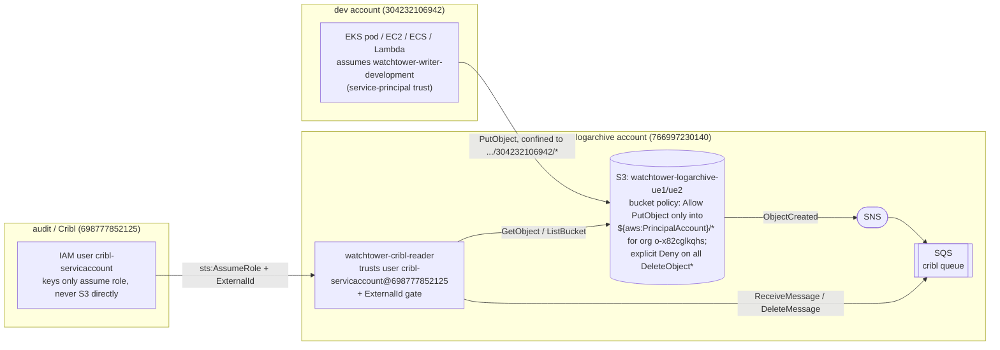

# IAM Trust — Verified Reference

Status: verified against **live AWS** on 2026-09-06 (both roles present, trust
and permission policies match the CDK source exactly). This doc explains the
trust model for the two ends of the log pipeline and records the verification.

Source of truth in code:

- Writer role: `cdk/stacks/workload_writer_stack.py`
- Reader role: `cdk/stacks/log_archive_stack.py` (created only in the primary region)
- Config: `cdk/configs/infrastructure.yaml`

## 1. The two roles at a glance

| ARN | Account | Side | Created by |
| --- | --- | --- | --- |
| `arn:aws:iam::766997230140:role/watchtower-cribl-reader` | `766997230140` (logarchive) | READ | `LogArchiveStack` (primary region only) |
| `arn:aws:iam::304232106942:role/watchtower-writer-development` | `304232106942` (development) | WRITE | `WorkloadWriterStack` (per workload account) |

These are opposite ends of one pipeline: workload compute **writes** log objects
into the logarchive S3 buckets; Cribl **reads** them back out. Two deliberately
different trust models.

## 2. Accounts referenced

| Account ID | Name | Role in the pipeline |
| --- | --- | --- |
| `766997230140` | logarchive | Owns the buckets, bucket policy, SNS/SQS, and the Cribl reader role. |
| `304232106942` | development | A workload account; owns its shared writer role. |
| `698777852125` | audit / Cribl | Home of the `cribl-servicaccount` IAM user that assumes the reader role. |

Org ID gating the bucket policy: `o-x82cglkqhs`.

## 3. Writer trust — `watchtower-writer-development`

Trust is **intra-account, service-principal based**. No human and no external
account is trusted. Four AWS service principals in account `304232106942` may
assume it:

| Sid | Principal (Service) | Actions | Compute type |
| --- | --- | --- | --- |
| (seed, no Sid) | `ec2.amazonaws.com` | `sts:AssumeRole` | EC2 instance profile |
| `EksPodIdentity` | `pods.eks.amazonaws.com` | `sts:AssumeRole`, `sts:TagSession` | EKS Pod Identity |
| `EcsTaskRole` | `ecs-tasks.amazonaws.com` | `sts:AssumeRole` | ECS task role |
| `LambdaExecutionRole` | `lambda.amazonaws.com` | `sts:AssumeRole` | Lambda execution role |

`sts:TagSession` is present only on the EKS statement because Pod Identity
requires it.

Permission policy (`WriterRoleDefaultPolicyE203178C`) — write-only, own prefix,
both regional buckets:

- `WriteOwnAccountPrefix`: `s3:PutObject`, `s3:AbortMultipartUpload` on
  - `arn:aws:s3:::watchtower-logarchive-us-east-1-766997230140/304232106942/*`
  - `arn:aws:s3:::watchtower-logarchive-us-east-2-766997230140/304232106942/*`
- `GetBucketLocation`: `s3:GetBucketLocation` on both bucket ARNs.

No delete anywhere. The `304232106942/*` prefix confinement is enforced twice:
here on the identity side, and on the resource side by the bucket policy (see §5).

## 4. Reader trust — `watchtower-cribl-reader`

Trust is a genuine **cross-account AssumeRole with an ExternalId gate**, for a
single named third-party IAM user:

- Trusted principal: `arn:aws:iam::698777852125:user/cribl-servicaccount`
  (one specific user in the audit/Cribl account — not the whole account, not a service).
- Condition: `StringEquals { sts:ExternalId = watchtower-<redacted> }`
  (literal value lives in `cdk/configs/infrastructure.yaml` under `reader.external_id`).
- Action: `sts:AssumeRole`.

The ExternalId is the confused-deputy guard standard for SaaS assuming your role.
It is enforced correctly as a **single conditioned statement** — the principal
itself carries the condition, so there is no unconditioned allow to bypass it.
(Trust statements are OR'd; an unconditioned `assumed_by` plus a separate
conditioned statement would NOT enforce the ExternalId. The code avoids that.)

Permission policy (`CriblReaderRoleDefaultPolicyE40D9762`) — read + queue-drain:

- `ReadWatchtowerBuckets`: `s3:GetObject`, `s3:GetObjectTagging`, `s3:ListBucket` on
  both regional buckets and their `/*` contents.
- `ConsumeWatchtowerCriblQueues`: `sqs:ReceiveMessage`, `sqs:DeleteMessage`,
  `sqs:ChangeMessageVisibility`, `sqs:GetQueueAttributes`, `sqs:GetQueueUrl` on
  `arn:aws:sqs:*:766997230140:watchtower-cribl-*` (wildcard region + name covers
  both regions' queues).

Cribl's static keys never touch S3 directly — they are only used to assume this
role, which is where the S3/SQS permissions live.

> **Both sides must allow the assume.** The trust policy above is only the
> *resource* side. The Cribl user also needs an *identity*-side
> `sts:AssumeRole` grant on this role ARN, which lives in the audit account and
> is **not** managed by this CDK app. See §4a.

## 4a. Reader identity-side grant — audit account (NOT in CDK)

Cross-account AssumeRole is authorized only when **both** ends allow it. This
CDK app owns just the resource side (the role + its trust policy in
`766997230140`). The identity side lives in the audit account `698777852125`
and is managed manually there.

- The `cribl-servicaccount` user has **no** policies of its own; all its
  permissions come from the IAM group **`CriblLogProcessing`**.
- That group's inline policy **`CriblAssumeRolePermissions`** carries the
  `sts:AssumeRole` grants. It must include a statement for the watchtower role,
  gated on the *watchtower* ExternalId (a separate statement from the older
  CloudTrail→Cribl grant, which uses a different ExternalId — one condition
  block cannot cover two different ExternalIds):

```json
{
  "Sid": "AssumeWatchtowerCriblReader",
  "Effect": "Allow",
  "Action": "sts:AssumeRole",
  "Resource": "arn:aws:iam::766997230140:role/watchtower-cribl-reader",
  "Condition": {
    "StringEquals": {
      "sts:ExternalId": "watchtower-<redacted>"
    }
  }
}
```

The pre-existing statement in the same policy (`AssumeCriblRoles`, for
`arn:aws:iam::*:role/IAMCriblLogProcessingRole` with ExternalId
`cribl-47f9f8c5-...`) is left untouched — the watchtower grant is additive.

**Incident (2026-09-07).** Cribl Cloud reported:

```
User: arn:aws:iam::698777852125:user/cribl-servicaccount is not authorized to
perform: sts:AssumeRole on resource:
arn:aws:iam::766997230140:role/watchtower-cribl-reader
```

Root cause: the reader role was deployed (resource side correct), but the
`CriblLogProcessing` group only granted assume on the old
`IAMCriblLogProcessingRole`, not on `watchtower-cribl-reader`. Fixed by
appending the `AssumeWatchtowerCriblReader` statement above via
`iam put-group-policy` on group `CriblLogProcessing` (profile `admin-audit`,
account `698777852125`). Verified the read-back contains both statements.

Reminder: the Cribl S3 Source must send the **watchtower** ExternalId
(`reader.external_id` in `infrastructure.yaml`), not the old
`cribl-47f9f8c5-...` value, or the role's trust condition still rejects it.

If this grant should ever be captured in IaC, the audit-account user/group would
need to be brought under management (a larger change than this app's scope).

## 5. End-to-end trust flow



Why two models:

1. **Write side** — the bucket doesn't trust the writer role by name. The bucket
   policy allows any org member (`aws:PrincipalOrgID = o-x82cglkqhs`) to
   `PutObject`, but only into `${aws:PrincipalAccount}/*`, so a role in
   `304232106942` is confined to `304232106942/*` on the resource side by AWS —
   independent of its identity policy. Onboarding a new workload account needs no
   bucket-policy change.
2. **Read side** — a specific external user assumes one role, ExternalId-gated.
   Permissions live on the role, not on the external user.

## 6. Verification record (2026-09-06)

Authenticated via AWS SSO (AdministratorAccess) per account:

- `admin-development` → `304232106942`
- `admin-logarchive` → `766997230140`

Checked with `iam get-role`, `iam list-role-policies`, `iam get-role-policy`:

| Item | Result |
| --- | --- |
| `watchtower-writer-development` trust policy | Matches CDK (4 service-principal statements; `TagSession` on EKS only). |
| `watchtower-writer-development` permission policy | Matches CDK (PutObject/AbortMultipartUpload on `304232106942/*` both regions; GetBucketLocation; no delete). |
| `watchtower-cribl-reader` trust policy | Matches CDK (single conditioned statement: user `cribl-servicaccount`@`698777852125` + ExternalId). |
| `watchtower-cribl-reader` permission policy | Matches CDK (S3 read on both buckets; SQS consume on `watchtower-cribl-*`). |

Both roles carry tags `project=cloud-watchtower`, `component=log-archive`, and
`watchtower-account=<development|logarchive>`. `MaxSessionDuration` is 3600s on
both. `RoleLastUsed` was empty on both at verification time (not yet exercised).

### 6a. Identity-side grant added (2026-09-07)

Authenticated `admin-audit` → `698777852125`. Confirmed the reader role's live
trust policy in `766997230140` matched the CDK exactly, then traced the
`cribl-servicaccount` user's permissions (no user-level policies; inherited from
group `CriblLogProcessing`). Its inline policy `CriblAssumeRolePermissions`
lacked any grant for `watchtower-cribl-reader`. Added the
`AssumeWatchtowerCriblReader` statement (see §4a) via `iam put-group-policy` and
verified the read-back contains both the old `AssumeCriblRoles` and the new
statement. Both ends of the cross-account trust now agree.

## 7. Note on the older design doc

`docs/iam-s3-design.md` §5 still describes the Cribl reader role as *"deferred —
high-level shape only."* That is stale: the reader role is fully implemented in
`log_archive_stack.py` and confirmed live here. Treat this file as the current
state for the reader side.
